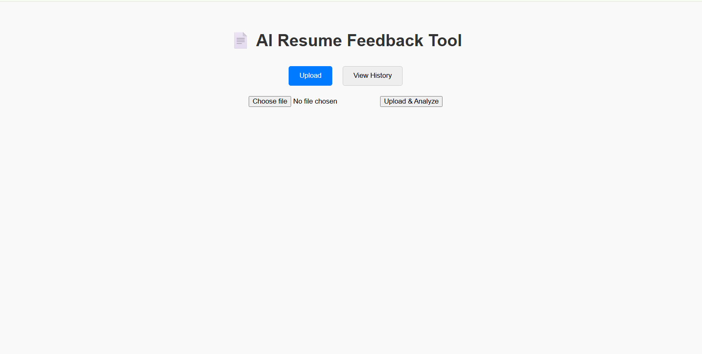
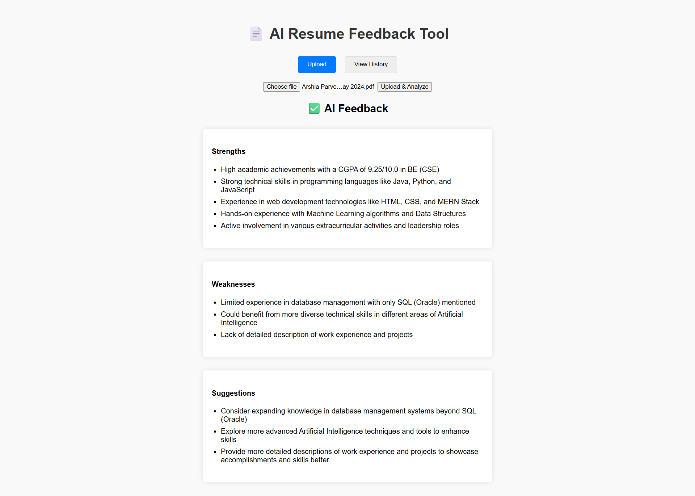
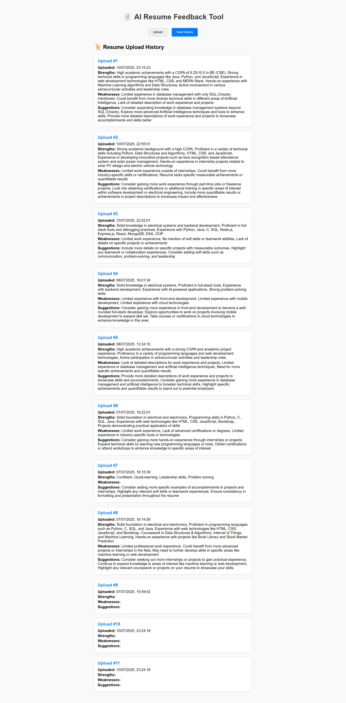

# 🧠 AI Resume Feedback Tool

This is a full-stack web application that allows users to upload their resumes (PDF or TXT) and receive AI-generated feedback highlighting strengths, weaknesses, and actionable suggestions.

## 🚀 Features

- Upload PDF or TXT resumes
- Extract text from uploaded files
- Analyze resumes using OpenAI API
- Display structured feedback: ✅ Strengths, ❌ Weaknesses, 💡 Suggestions
- MongoDB integration to store resume and feedback history
- Clean React UI with tabbed feedback display

## 🛠️ Tech Stack

- **Frontend:** React, HTML, CSS, JavaScript
- **Backend:** Node.js, Express.js
- **Database:** MongoDB Atlas
- **AI Integration:** OpenAI GPT API
- **Other:** Multer (file upload), pdf-parse (PDF text extraction), dotenv

## 📁 Folder Structure

ai-resume-feedback-tool/
├── client/ # React frontend
├── server/ # Node.js backend
│ ├── models/ # Mongoose models
│ ├── index.js # Main server file
├── .gitignore
├── README.md


> 🔐 Note: Sensitive info like API keys are stored in a `.env` file which is ignored via `.gitignore`.

## 🧪 How to Run Locally

### 1. Clone the repository

```bash
git clone https://github.com/ritwikduggi9/ai-resume-feedback-tool.git
cd ai-resume-feedback-tool

**2. Setup backend**
cd server
npm install
# Create a .env file with your MongoDB URI and OpenAI API key
npm start

**3. Setup frontend**
cd client
npm install
npm start

**4. Usage**
Visit http://localhost:3000

Upload a resume (PDF or TXT)

View AI feedback in the UI

## 🖼️ Project Screenshots

### 🔹 Upload Resume Interface


### 🔹 AI Feedback Display


### 🔹 View History Feature



📌 Future Improvements
Job description matching

Feedback export as PDF

User authentication & dashboard

👨‍💻 Author
Ritwik Duggi
